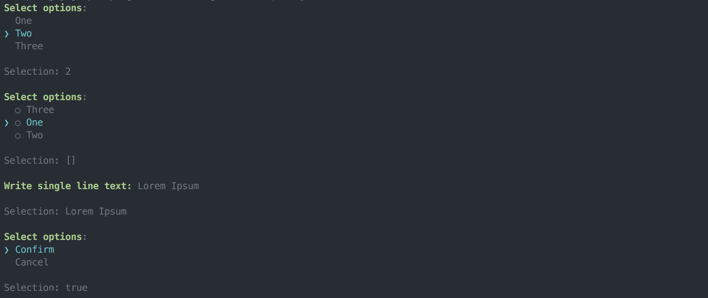

# Go Prompt

**Work in progress**

Interactive terminal inputs.



## Elements

### Select

```
selection1, _ := prompt.Select("Choose one option", prompt.Options{
	"1": "One",
	"2": "Two",
	"3": "Three",
})
fmt.Println("Selection:", selection1)
```

### Select

```
selection, _ := prompt.MultiSelect("Choose multiple options", prompt.Options{
  "1": "One",
	"2": "Two",
	"3": "Three",
})
fmt.Println("Selection:", selection)
```

### Input

```
selection, _ := prompt.Input("Write single line text", "")
fmt.Println("Selection:", selection)
```

### Confirm

```
selection, _ := prompt.Confirm("Do you want to go on?")
fmt.Println("Selection:", selection)
```

## Prior Art

- [paulrademacher/climenu](https://github.com/paulrademacher/climenu)